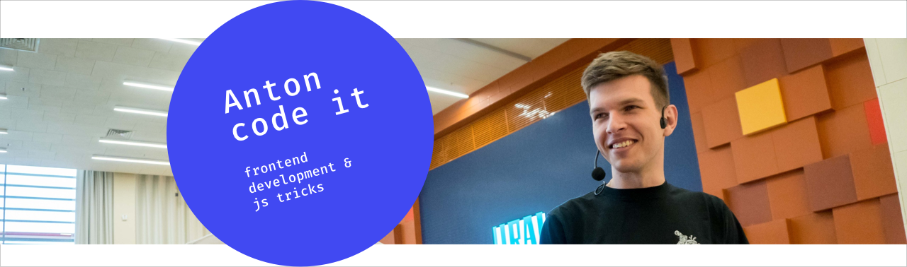

This repository contains all sources from the live coding sessions for ["Anton code it"](http://bit.ly/antoncodeit-youtube) youtube channel.

[Youtube channel](http://bit.ly/antoncodeit-youtube)

[Chat on Telegram](http://bit.ly/antoncodeit-chat)

### Workflow

For every task I create issue with link to the problem's statement and it's estimate. You can send your own solution as PR to the issue. One of your solutions can get code review after my solution & explanation.

Star repo, send your PR's, subscribe to [the youtube channel](http://bit.ly/antoncodeit-youtube) and share your knowledge on [the Telegram chat](http://bit.ly/antoncodeit-chat).

Let's improve skills! See you.
